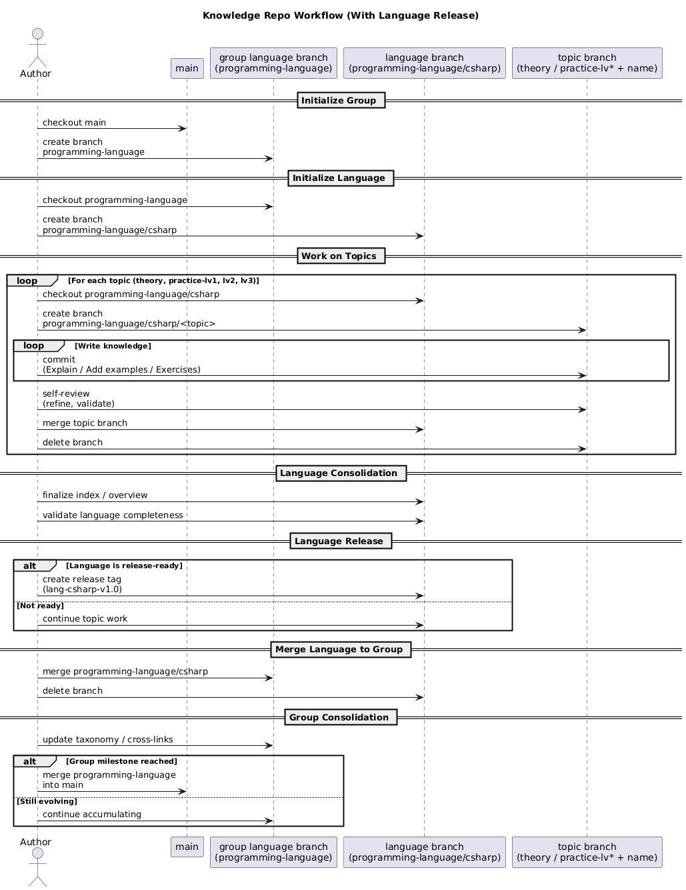

# Language Core Lab

This repository is a **programming language encyclopedia**.

Its purpose is to document a programming language **from its conceptual foundations to expert-level internals**, covering not only *how* the language is used, but *why* it was designed, *how* it executes on real hardware, and *what trade-offs* it makes across different domains.

This is **not a tutorial**, **not a quick learning path**, and **not framework-oriented**.
It is a structured, long-term knowledge system intended to be read, referenced, and expanded over time.

## Scope and Philosophy

This repository treats a programming language as a **complete system**, including:

- Historical context and design philosophy  
- Syntax, semantics, and type system fundamentals  
- Major programming paradigms and their practical implications  
- Runtime architecture, memory management, concurrency, and performance  
- Compilation models, execution pipelines, and language internals  
- Real-world application domains and ecosystem tooling  
- System-level knowledge required to deploy and operate software at scale  

Each topic is explained with an emphasis on:
- **First principles** rather than surface syntax
- **Trade-offs and constraints** rather than dogma
- **Mental models** that remain valid across versions and frameworks

## Intended Audience

This repository is designed for:
- Engineers who want to **truly understand a language**, not just use it
- Developers building **large systems, libraries, or frameworks**
- Professionals transitioning toward **senior, architect, or systems roles**
- Anyone seeking a **reference-grade understanding** rather than short-term productivity

## How to Use This Repository

- Read it **non-linearly**, as a reference
- Revisit sections as your experience grows
- Treat it as a **living knowledge base**, not a finished product

> This repository aims to become a **personal encyclopedia of a programming language**, not a learning checklist.

## Git Workflow

[PlantUMLWebsite](//www.plantuml.com/plantuml/png/bPLFRzGy4CRl-HIZdhhlsx0KReYjMg6249G38FNIo-1C4siTJsHFibi-FVxJhTieMi4bqkxOp_FuDnFdqWiw6NjJYHP3yCNopb3J4dodWU6MtVRUy0vERxLqy1LjEs8g6a9Fgwf29UpWQfIENJK4BQtqW5RWf4TjJm0ztA2sBqkjut40Sr3xvT2gxiwU3evRXtslRLiVggkayIdkU2doTzlNodVeXgIIyhyK4HwqAWhI4Ri7MCFWK8LLL9lfF_WVBFQFGNx63LMrsS1dgqMZqRyffuFDfgeo2AWlqgdVWUf8RNaKY3HADUy8PKSevGHB1vXvbHuKko9O_9QaolAaico_p2-bYDC0R3C3dm8OvW4-iWD2rK6c-KZnx3d4ypCmqvluUBkg003cKHQ3pqBCDgOO_tA8zViKyA9AGYdwhTD2i3rCVIeikt2Gb30Yr_l1eBQmXgkc0TfZFnZouUVrdfpIddm-8DccMWxioTpNZYPDkw3dw5vREeC9ZMvGQ1bFJwubU3wjozeD6Ng2KQKCcqsPcGziFISVpJOrS6uKmkGvqxQXFQo19t8nwdpbK-3o7YkEB8GiUPzyv_T5SaGZfQ0zk5mBHB1vM3nyxl1X8GYsWLjqhNDVw-dyrUjLHIOKlx704IMsekru8BbZjts2T1CHbsJ2Ywzr-k_GZsEpEhEUTIOQ9gbvIvRCnY5n5jopvJvUJygnzxNHTkipqApLQqDUs594e3fg2eHo9nt9VcUr5SvtLQBvGxGnG1ERAQnBQlDqXIagDVQZGObB4zNBy8pVbZy0)
```
@startuml
title Knowledge Repo Workflow (With Language Release)

actor Author
participant "main" as Main
participant "group language branch\n(programming-language)" as Group
participant "language branch\n(programming-language/csharp)" as Lang
participant "topic branch\n(theory / practice-lv* + name)" as Topic

== Initialize Group ==

Author -> Main: checkout main
Author -> Group: create branch\nprogramming-language

== Initialize Language ==

Author -> Group: checkout programming-language
Author -> Lang: create branch\nprogramming-language/csharp

== Work on Topics ==

loop For each topic (theory, practice-lv1, lv2, lv3)
    Author -> Lang: checkout programming-language/csharp
    Author -> Topic: create branch\nprogramming-language/csharp/<topic>

    loop Write knowledge
        Author -> Topic: commit\n(Explain / Add examples / Exercises)
    end

    Author -> Topic: self-review\n(refine, validate)
    Author -> Lang: merge topic branch
    Author -> Topic: delete branch
end

== Language Consolidation ==

Author -> Lang: finalize index / overview
Author -> Lang: validate language completeness

== Language Release ==

alt Language is release-ready
    Author -> Lang: create release tag\n(lang-csharp-v1.0)
else Not ready
    Author -> Lang: continue topic work
end

== Merge Language to Group ==

Author -> Group: merge programming-language/csharp
Author -> Lang: delete branch

== Group Consolidation ==

Author -> Group: update taxonomy / cross-links

alt Group milestone reached
    Author -> Main: merge programming-language\ninto main
else Still evolving
    Author -> Group: continue accumulating
end

@enduml


```
